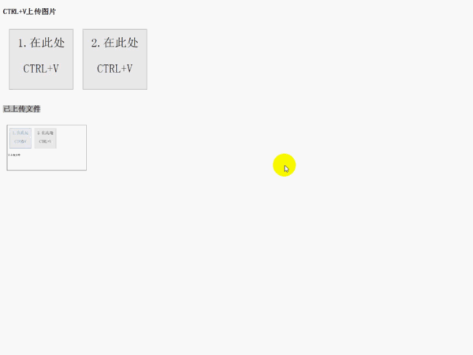

##背景
最近公司要做一个ctrl+V 上传图片的组件。简单说就是，使用截屏工具截一张图，然后在某个元素上按ctrl+v操作，需要将截的图上床至服务端，服务端保存图片并返回对应的地址;所以封装了组件做这事，发布出来记录下。


# ctrv-upload
手动截屏后，鼠标移动至某元素，按ctrlv进行图片上传。

## 兼容性说明
由于代码中使用到clipboardData对象及paste事件，目前只能兼容到高版本Chrome，FireFox及IE 11。

## 实现原理及过程

### 原理： 
- 对于webkit内核，input、textarea、contentEditable属性为true的元素可响应paste事件，可通过事件对象中的clipboardData对象属性访问粘贴板数据。
- 对于FireFox及IE 11，在contentEditable属性为true的元素上进行ctrl+v操作时，会在目标元素中插入img元素，img元素的src属性即为截图的base64数据。
- 获取到图片的base64数据后提交给后台程序php，可在服务端保存为图片。

### 实现过程
1. 在目标元素前插入contentEditable属性为true的div元素，用于响应paste事件；
2. 在目标元素上做ctrl+v操作时，响应paste事件，通过event.clipboardData对象或者获取在目标元素中插入的img元素得到图片的base64数据。
3. ajax上传图片base64数据至服务端。


## 安装

```sh
npm install ctrv-upload
```

## 使用
支持AMD与CommonJs的方式加载模块,

直接引入：`<script src="xxx/ctrv-upload/index.js">`

 AMD: `define(['xxx/ctrv-upload/index'],function(ctrlVUtil){});`

 COMMONJS: `var ctrlVUtil = require("ctrv-upload");`

#### 调用
```


var load1 = document.querySelector(".js-upload");

// 实例化即可
new ctrlVUtil({
    uploadUrl: "server.php",
    targetElement: load1,
	isCompleteImg：false,
    data:{
        name:"alanzhang"
    },
    success:function(data){
        alert("上传成功");
        console.log(data);
    },
	error: function(error){
		alert("上传失败");
	}
});

```


#### 参数说明

| 名称 | 参数 | 默认值 |
| :--: | :--- | :--: | 
| `uploadUrl` | 上传地址 |  需自定义 | 
| `targetElement` | 鼠标放在该元素上时，可响应ctrl+v操作 | `document.querySelector(".js-upload")` | 
| `isCompleteImg` | 上传图片base64的格式，`false`表示只上传content部分，即不包括头信息`data:image/jpg;base64`，true表示上传完整的base64字符串 |`false` | 
| `data` |需要上传的其他参数，json对象 | 空 |
| `success` | 上传成功时的回调函数，其参数为接口返回的json对象 | - | 
| `error` | 上传成功时的回调函数，其参数为接口返回的json对象 | - | 


## API
### `ctrlVUtil(config)`
构造函数，参数：

- `config`: 上传图片的相关参数，json对象，具体字段见参数说明。

### `ctrlVUtil#alertMsg(content)`
静态方法，用于弹出异常信息的提示，默认使用`window.alert(content)`弹出提示；提供此方法用于使用者自定义弹出提示的样式。
- `content`:组件给出的异常提示信息

## 开发
1. 源码位于src/index.js，开发完成后执行webpack打包，生成根目录下的index.js。
2. 实例项目examples中ctrlVMain.js中引用了根目录下的index.js文件，在运行测试文件时也许进行gulp打包操作。

## 版本记录

### 1.0.2 2016-08-22
- 修正readme

### 1.0.1 2016-08-22
- 修正readme

### 1.0.0 2016-08-22
- 初始化版本，完成代码及文档

## 参考文档

- [Accessing Clipboard Images with Javascript](http://joelb.me/blog/2011/code-snippet-accessing-clipboard-images-with-javascript/)
- [js实现剪切板效果复制黏贴图片](http://blog.csdn.net/qq_26786555/article/details/45541731)
- [利用 clipboardData 在网页中实现截屏粘贴的功能](http://stylechen.com/clipboarddata.html)
